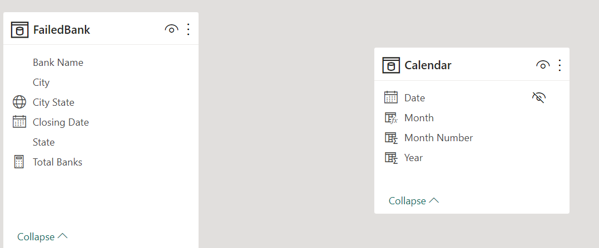
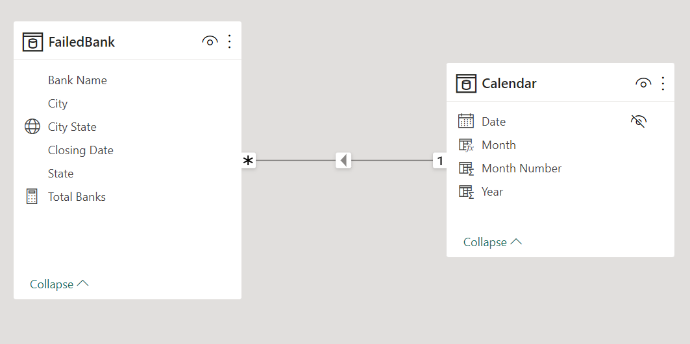
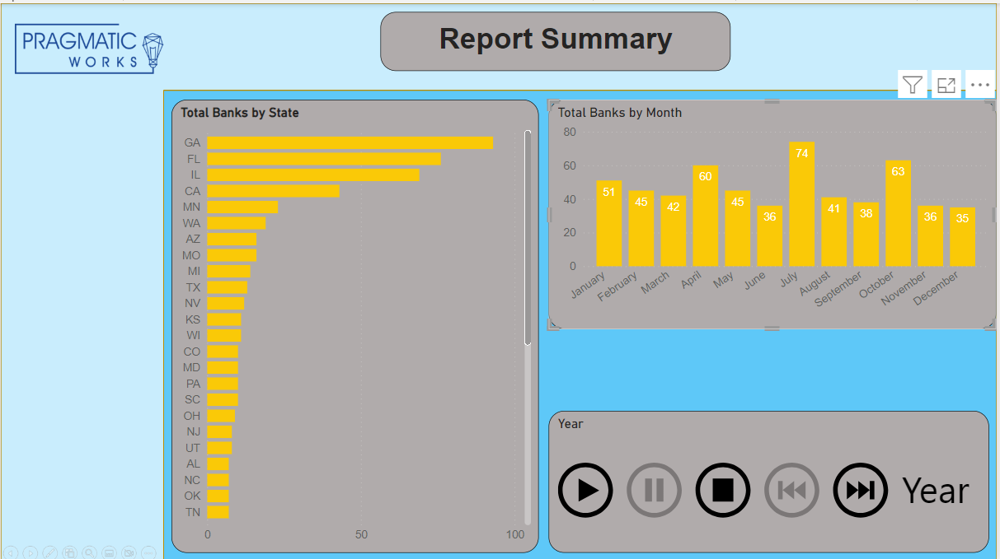

# USA-Failed-Banks-Report-Summary

---

## Introduction 
This is a simple Power Bi project on the list of failed banks in the United States of America. The project is to analyze and derive insights to answer questions and help the stakeholders make data-driven decisions. 
_The dataset was generated from the website of the **Federal Deposit Insurance Corporation** (FDIC)_. 

## Problem Statement
1. Which state has the highest number of failed banks?
2. Which month recorded the highest number of failed banks?
3. In What year did the highest number of banks fail?

## Skills and Concepts Demonstrated

The following Power BI features were incorporated:
- Bookmarking,
- DAX,
- Quick measures,
- Page navigation,
- Modelling filters,
- Tooltips,
- Button

## Modeling
The automatic derived model was adjusted to suit the available tables in the model in a many-to-one relationship.  

Auto-Model       |    Adjusted model
:--------------------|:----------------:
  |   

The Calendar table is a dimension table. I connected the Date column with the corresponding Date column in fact table (Failed Banks). I now filtered the fact table with dimension table.

## Visualization 

The report is a Multi-paged report
You can interact with the report [here](https://app.powerbi.com/groups/me/reports/6e9e80d2-554f-411a-8ff6-0d5572c2dc02?experience=power-bi)

Features:
- Total failed banks by State
- Total failed banks by Month.
- A Play Axis visual. It works like a dynamic slicer that animates the other report visuals without needing to click every time you want to change your filter.

## Analysis

### Total failed banks by State
- GA has the highest number of failed banks.
- TN has the lowest number of failed banks.

### Total failed banks by Months
- July recorded the highest number of failed banks between the period - 76 banks.
- 36 banks failed in June, November, and December respectively. These are the lowest number of failed banks within the year.

## Conclusion:
- Banks in GA, FL, IL, and CA are more likely to fail than banks in other states.
- Bank failure is more likely to happen in July than in other months.

## Reconmendations:
- The FDIC should pay more regulatory attention to bthe banks in GA, FL, IL, and CA.
